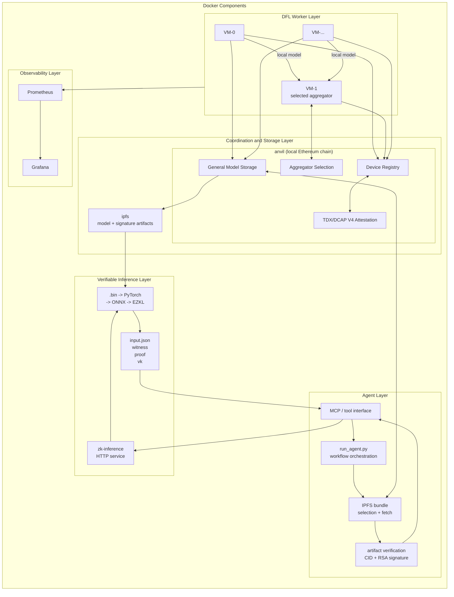
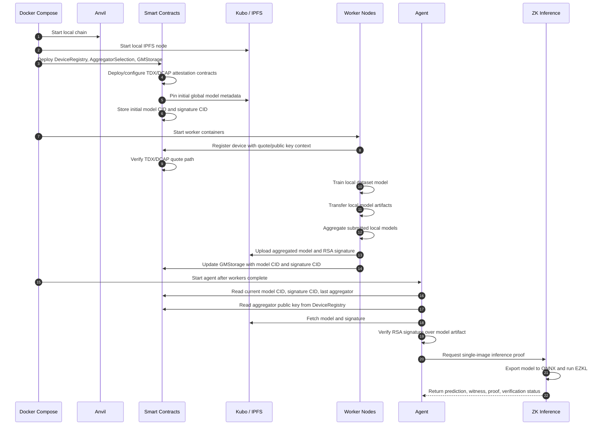

# Master Thesis Prototype: Trusted DFL and Verifiable Inference

[](https://github.com/uZhW8Rgl/Master-Thesis/actions/workflows/ci.yml)

This repository contains a proof-of-concept implementation for trusted decentralized federated learning (DFL), model provenance, and verifiable single-image inference.

The current prototype combines:

- decentralized CNN training with multiple worker nodes,
- smart-contract-based coordination and model metadata,
- immutable per-round aggregation thresholds, deterministic adaptive robust
  candidate selection on a separately signed validation split, and TEE-signed
  input/output statements with atomic model publication,
- local IPFS/Kubo storage for global model artifacts,
- TDX/DCAP quote verification through Solidity contracts,
- RSA signature verification for global model artifacts,
- EZKL-based zero-knowledge inference for a single dataset image,
- AIR/TDX-bound ChestMNIST inference in a digest-pinned Phala TEE,
- SCITT-CCF registration and local verification of transparency receipts,
- and a local LangChain/Ollama agent that orchestrates contract lookup, artifact verification, and proof generation.

## Repository Structure

- [compose.yml](./compose.yml): Docker Compose entry point for local end-to-end runs.
- [.env.example](./.env.example): Local runtime settings without worker identities.
- [.env.shared.example](./.env.shared.example): Shared configuration across local Anvil and Sepolia profiles.
- [.env.phala.anvil.example](./.env.phala.anvil.example): Chain-specific values for local Anvil runs.
- [.env.sepolia.example](./.env.sepolia.example): Chain-specific values for Sepolia runs.
- [data](./data): Shared local input artifacts and helpers. Generated RSA worker keys are local-only and ignored by Git.
- [observability](./observability): Grafana and Prometheus configuration.
- [smart_contracts](./smart_contracts/README.md): Focused Foundry project with DFL contracts and TDX/DCAP attestation deployment logic.
- [dfl/node_server](./dfl/node_server/README.md): Node.js orchestration layer used by each worker.
- [dfl/neural_network](./dfl/neural_network/README.md): Python/PyTorch CNN training, transfer, aggregation, and model serialization.
- [zk_inference](./zk_inference/README.md): ONNX export, single-image query creation, EZKL proof generation, and proof verification.
- [tee_inference](./tee_inference/README.md): PyTorch ChestMNIST inference service with deterministic CBOR and AIR/TDX evidence.
- [transparency_log](./transparency_log/README.md): Persistent Microsoft SCITT-CCF ledger in virtual mode.
- [agent](./agent/README.md): Local LangChain/MCP agent for contract-based model lookup, ZK inference, and verified TEE inference with SCITT registration.

## Architecture

The prototype is organized around a Docker Compose runtime. The diagrams below show the main runtime components and the end-to-end execution path from local infrastructure startup to verifiable inference.

### Runtime Component Overview



### End-to-End Sequence



## Component Responsibilities

| Component | Responsibility | Main entry point |
| --- | --- | --- |
| `compose.yml` | Local orchestration for infrastructure, contracts, workers, agent, and proof service | `docker compose up --build` |
| `smart_contracts` | DFL coordination, device registry, model metadata, and TDX/DCAP deployment scripts | `smart_contracts/starter_docker.sh` |
| `dfl/node_server` | Worker orchestration, contract interaction, timing logic, and metrics | `dfl/start_node_neural_network.sh` |
| `dfl/neural_network` | PyTorch training, local model transfer, aggregation, and serialization | `dfl/neural_network/cli.py` |
| `ipfs` | Local content-addressed storage for global model artifacts | Kubo API on `127.0.0.1:5001` |
| `agent` | Contract-based model lookup, artifact fetching, signature verification, and proof orchestration | `agent/run_agent.py` |
| `zk_inference` | ONNX export, single-query generation, EZKL witness/proof generation, and verification | `zk_inference/server.py` |
| `observability` | Local metrics and dashboarding | Grafana on `127.0.0.1:3300` |

## Design Notes

- `GMStorage` is treated as the source of truth for the active global model and signature CIDs.
- IPFS stores bytes, but authenticity is checked through on-chain metadata and the aggregator's registered public key.
- TDX/DCAP verification is represented by the on-chain attestation deployment and quote verification flow used during worker registration.
- The ZK inference path proves one selected single-image inference over the exported model artifacts; it complements, but does not replace, model provenance checks.
- The local runtime is intended as a reproducible research prototype rather than a production deployment.

## Reproducible Demo

For a clean local demo, start from a fresh stack and use Docker Compose as the single entry point:

```bash
docker compose --env-file .env.example --env-file .env.phala.anvil.example \
  down --volumes --remove-orphans
KEEP_ALIVE=0 docker compose --env-file .env.example \
  --env-file .env.phala.anvil.example up --build --force-recreate
```

If Docker reports `Conflict. The container name "/ipfs_local" is already in use`, a separate Kubo/IPFS container is already running on your machine with the same fixed name and host ports. Stop and remove that old container before starting this stack:

```bash
docker stop ipfs_local
docker rm ipfs_local
```

The `.env` file is intentionally ignored by Git. For new setups, prefer split profiles over a single mixed file:

```bash
cp .env.shared.example .env.shared
cp .env.phala.anvil.example .env.phala.anvil
cp .env.sepolia.example .env.sepolia
./scripts/use-env-profile.sh anvil
```

This keeps common values in `.env.shared`, puts chain-specific values into `.env.phala.anvil` or `.env.sepolia`, and regenerates the active `.env` from the selected profile. That avoids dangerous mixes such as a Sepolia RPC together with Anvil contract addresses.

This is the recommended demo run for the thesis prototype. It rebuilds the active services, launches the local infrastructure, deploys the contracts, runs the DFL flow, stores the new global model in IPFS, and updates the on-chain metadata.

After the stack is up, the browser frontend is available at:

- `http://127.0.0.1:8089` for the thesis agent website with the chat UI and embedded Grafana dashboard
- `http://127.0.0.1:3300` for the standalone Grafana instance

## Demo Outcome

When the run completes successfully, you should have:

- a local Anvil chain with deployed DFL and attestation contracts,
- a local IPFS node with the global model and signature pinned,
- completed worker runs for training and aggregation,
- observability data in Grafana and Prometheus,
- the website at `http://127.0.0.1:8089` with the agent chat and dashboard view,
- and a ready-to-run verifiable inference path through `agent/run_agent.py`.

The most important generated outputs are:

- `agent/downloads/`: model and signature bundles fetched by the agent
- `zk_inference/out/`: ONNX, EZKL settings, witness, proof, and verification key
- `zk_inference/single_query/`: single-image query input and prediction metadata
- `smart_contracts/broadcast/`: deployment metadata and latest contract addresses

## Recommended Local Run

The Docker setup is the primary way to run the DFL prototype:

```bash
docker compose --env-file .env.example --env-file .env.phala.anvil.example \
  down --volumes --remove-orphans
KEEP_ALIVE=0 docker compose --env-file .env.example \
  --env-file .env.phala.anvil.example up --build --force-recreate
```

This starts Anvil, Kubo/IPFS, observability services, deploys the smart contracts, registers workers through an explicitly local mock verifier with the same address/key/nonce binding as production, runs training, aggregates local models, stores the new global model and signature in IPFS, and updates the on-chain model metadata. The local mock is not a hardware attestation; Phala uses live TDX quotes only.

For local Anvil runs, `P256_MODE=native` is the default. The deployment script probes the native P-256 precompile at `0x0000000000000000000000000000000000000100` and uses it when available. If the current Anvil build does not expose the precompile, the script installs the local P-256 verifier at the same canonical address so the contracts still use the native verifier address. `P256_MODE=fallback` can be used to force the Daimo fallback verifier address instead.

The local stack starts:

- Anvil as local Ethereum-compatible chain,
- Kubo as local IPFS node,
- the `smart-contracts` deployment container,
- three DFL worker containers,
- Grafana and Prometheus.

`.env.example` provides local timing, contract, IPFS, and dataset settings;
`.env.phala.anvil.example` is the single tracked worker-identity source. Pass
them to Compose in that order so the worker fields come from the latter file.
`IPFS_PROVIDER` is a strict switch: `kubo` uses only the local Kubo
API/gateway, while `pinata` uses only the configured Pinata gateway/JWT path.
Generate the ignored development RSA files needed by the local bind mounts
with `scripts/prepare_dfl_worker_experiment.py`; they are runtime material, not
a Phala credential source, and are not copied into images.

For dataset experiments, `DATASET_NAME=mnist` remains available for local
utility runs. The policy-bound adaptive aggregation path requires
`DATASET_NAME=chestmnist`, ChestMNIST worker shards, and the signed,
training-disjoint validation artifact under `data/chestmnist`. The independent
test split remains reporting-only.

## Quick Verification

After `docker compose up`, these quick checks confirm that the core demo finished in a meaningful state:

1. Check that the main containers are healthy or completed:

```bash
docker compose ps
```

2. Query the current global model CID from `GMStorage`:

```bash
cast call 0x9fE46736679d2D9a65F0992F2272dE9f3c7fa6e0 \
  "getGlobalModel()(string)" \
  --rpc-url http://127.0.0.1:8545
```

3. Run the local verifiable inference agent:

```bash
.venv/bin/python agent/run_agent.py \
  --source contract \
  --rpc-url http://127.0.0.1:8545 \
  --gm-storage-address 0x9fE46736679d2D9a65F0992F2272dE9f3c7fa6e0 \
  --registry-address 0x5FbDB2315678afecb367f032d93F642f64180aa3 \
  --ipfs-api-url http://127.0.0.1:5001 \
  --skip-calibration
```

4. Inspect the resulting proof artifacts:

```bash
ls -lah zk_inference/out
ls -lah zk_inference/single_query
```

## Stack Flow

The sequence diagram above visualizes this flow.

1. Starts Anvil and Kubo.
2. Deploys core DFL contracts from `smart_contracts`.
3. Deploys Automata PCCS and TDX/DCAP attestation contracts.
4. Uploads PCCS collateral.
5. Pins the initial global model to IPFS and writes model metadata on-chain.
6. Starts workers.
7. Registers local workers through the local-only mock verifier while enforcing the production REPORTDATA binding and replay nonce.
8. Runs local training and model transfer.
9. Aggregates submitted local models.
10. Signs and uploads the new global model and signature.
11. Updates `GMStorage` with the new model CID and signature CID.

## Observability

The local stack exposes:

- Grafana: <http://127.0.0.1:3300>
- Prometheus: <http://127.0.0.1:9090>
The Grafana dashboards use Prometheus metrics exported by the control API and the local services.

## Useful Commands

Open the local IPFS Web UI:

```text
http://127.0.0.1:5001/webui
```

Query the current global model from `GMStorage`:

```bash
cast call 0x9fE46736679d2D9a65F0992F2272dE9f3c7fa6e0 \
  "getGlobalModel()(string)" \
  --rpc-url http://127.0.0.1:8545
```

Query the current global model signature:

```bash
cast call 0x9fE46736679d2D9a65F0992F2272dE9f3c7fa6e0 \
  "getGlobalModelSignature()(string)" \
  --rpc-url http://127.0.0.1:8545
```

Clean the local stack:

```bash
docker compose -f compose.yml down --volumes --remove-orphans
```

## Agent and Verifiable Inference

After a DFL run, the agent can read the latest model metadata from the smart contracts, fetch the model and signature from IPFS, verify the signature against the last aggregator's registered public key, and run a verifiable single-image inference:

```bash
.venv/bin/python agent/run_agent.py \
  --source contract \
  --rpc-url http://127.0.0.1:8545 \
  --gm-storage-address 0x9fE46736679d2D9a65F0992F2272dE9f3c7fa6e0 \
  --registry-address 0x5FbDB2315678afecb367f032d93F642f64180aa3 \
  --ipfs-api-url http://127.0.0.1:5001 \
  --skip-calibration
```

The result includes the selected input image, predicted label, proof artifact, witness, and verification status.

## Important Generated Artifacts

Some runs create local build and proof outputs:

- `smart_contracts/out/`: Foundry artifacts for the main Foundry project.
- `smart_contracts/lib/automata-dcap-v3-attestation/lib/automata-on-chain-pccs/out/`: Foundry artifacts for the PCCS subproject.
- `zk_inference/out/`: ONNX, EZKL settings, witness, proof, and verification key.
- `zk_inference/single_query/`: single-image query input and prediction metadata.
- `agent/downloads/`: model and signature bundles fetched by the agent.
- `tee_inference/out/`: the latest locally verified TEE evidence and transparent SCITT statement.
- `agent/state/scitt/`: persistent X.509 identity used by the agent to submit evidence to SCITT.

## GitHub Workflow

The repository now includes a GitHub Actions CI pipeline for:

- repository hygiene and Docker Compose validation,
- Python linting and formatting checks with Ruff,
- Node.js build and tests,
- Foundry contract builds,
- Docker image builds,
- and a runtime smoke test for the core containerized stack.

On pushes to `main`, the Docker build job publishes the project images to GitHub Container Registry:

```bash
docker pull ghcr.io/uzhw8rgl/master-thesis-agent:latest
docker pull ghcr.io/uzhw8rgl/master-thesis-zk-inference:latest
docker pull ghcr.io/uzhw8rgl/master-thesis-tee-inference:latest
docker pull ghcr.io/uzhw8rgl/master-thesis-transparency-log:latest
docker pull ghcr.io/uzhw8rgl/master-thesis-dfl-worker:latest
docker pull ghcr.io/uzhw8rgl/master-thesis-smart-contracts:latest
```

Each image is also tagged with the commit SHA, for example `ghcr.io/uzhw8rgl/master-thesis-agent:<commit-sha>`.

## Notes

- The active neural-network implementation is Python/PyTorch in `dfl/neural_network`.
- `smart_contracts` is the active contract and attestation project.
- The combined `run_verified_tee_inference` MCP tool verifies the TEE evidence before submitting its exact bytes to SCITT-CCF, and verifies the returned CCF receipt before returning the inference result.
- The SCITT log proves registration, integrity, and ordering of the signed evidence. It does not by itself validate Intel DCAP collateral; that distinction remains explicit in the tool output.
- The healthcare setting is the motivating scenario. The concrete prototype now supports a compact CNN on MNIST and a ChestMNIST training/query path. A full ChestMNIST Compose plus EZKL proof run should still be treated as an integration test to complete.
