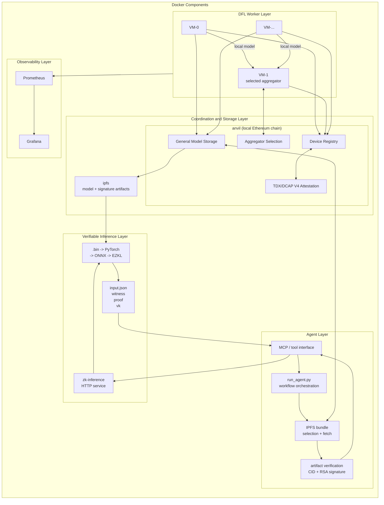

# Master Thesis Prototype: Trusted DFL and Verifiable Inference

[](https://github.com/uZhW8Rgl/vita-fl/actions/workflows/ci.yml?query=branch%3Aphala_app_key)

This repository contains a proof-of-concept implementation for trusted decentralized federated learning (DFL), model provenance, and verifiable single-image inference.

The current prototype combines:

- decentralized CNN training with multiple worker nodes,
- smart-contract-based coordination and model metadata,
- immutable per-round aggregation thresholds, deterministic equal-weight
  federated averaging, and TEE-signed input/output statements with atomic
  model publication,
- local IPFS/Kubo storage for global model artifacts,
- TDX/DCAP quote verification through Solidity contracts,
- RSA signature verification for global model artifacts,
- EZKL-based zero-knowledge inference for a single dataset image,
- AIR/TDX-bound ChestMNIST inference in a digest-pinned Phala TEE,
- SCITT-CCF registration and local verification of transparency receipts,
- and a local LangChain/Ollama agent that orchestrates contract lookup, artifact verification, and proof generation.


## Preview, recreate, or delete

Run these commands from this directory with your configured deployment profile:

```bash
bash phala/start.sh

# Preview changes without applying or deleting resources.
bash phala/start.sh --dry-run

# Delete the existing demo and create a fresh runtime.
bash phala/start.sh --recreate

# Delete the deployment, including leftover worker CVMs.
bash phala/start.sh --destroy
```

`--recreate` and `--destroy` erase the current run's chain state, IPFS data, and
training progress. After recreation, start training yourself in the UI.

## Architecture

The diagram below shows the main runtime components and their connections.

### Runtime Component Overview


