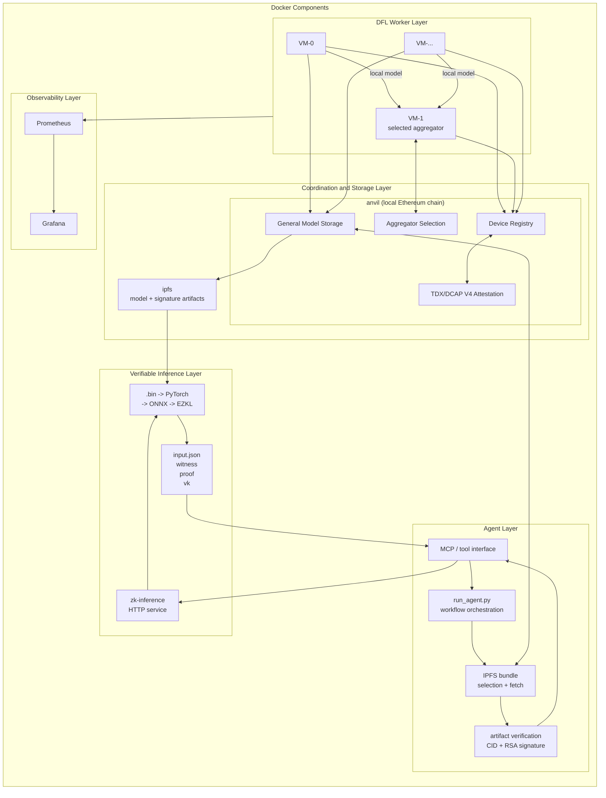

# Master Thesis Prototype: Trusted DFL and Verifiable Inference

[](https://github.com/uZhW8Rgl/vita-fl/actions/workflows/ci.yml)

This repository contains a proof-of-concept implementation for trusted decentralized federated learning (DFL), model provenance, and verifiable single-image inference.

The current prototype combines:

- decentralized CNN training with multiple worker nodes,
- smart-contract-based coordination and model metadata,
- immutable per-round aggregation thresholds, deterministic equal-weight
  federated averaging, and TEE-signed input/output statements with atomic
  model publication,
- local IPFS/Kubo storage for global model artifacts,
- TDX/DCAP quote verification through Solidity contracts,
- RSA signature verification for global model artifacts,
- EZKL-based zero-knowledge inference for a single dataset image,
- AIR/TDX-bound ChestMNIST inference in a digest-pinned Phala TEE,
- SCITT-CCF registration and local verification of transparency receipts,
- and a local LangChain/Ollama agent that orchestrates contract lookup, artifact verification, and proof generation.

## Repository Structure

- [compose.yml](./compose.yml): Docker Compose entry point for local end-to-end runs.
- [.env.example](./.env.example): Local runtime settings without worker identities.
- [.env.shared.example](./.env.shared.example): Shared configuration across local Anvil and Sepolia profiles.
- [.env.phala.anvil.example](./.env.phala.anvil.example): Chain-specific values for local Anvil runs.
- [.env.sepolia.example](./.env.sepolia.example): Chain-specific values for Sepolia runs.
- [data](./data): Shared local input artifacts and helpers. Generated RSA worker keys are local-only and ignored by Git.
- [observability](./observability): Grafana and Prometheus configuration.
- [smart_contracts](./smart_contracts/README.md): Focused Foundry project with DFL contracts and TDX/DCAP attestation deployment logic.
- [dfl/node_server](./dfl/node_server/README.md): Node.js orchestration layer used by each worker.
- [dfl/neural_network](./dfl/neural_network/README.md): Python/PyTorch CNN training, transfer, aggregation, and model serialization.
- [zk_inference](./zk_inference/README.md): ONNX export, single-image query creation, EZKL proof generation, and proof verification.
- [tee_inference](./tee_inference/README.md): PyTorch ChestMNIST inference service with deterministic CBOR and AIR/TDX evidence.
- [transparency_log](./transparency_log/README.md): Persistent Microsoft SCITT-CCF ledger in virtual mode.
- [agent](./agent/README.md): Local LangChain/MCP agent for contract-based model lookup, ZK inference, and verified TEE inference with SCITT registration.

## Published Container Images

The current published tags and immutable deployment references are:

| Component | Tag | Digest-pinned reference |
| --- | --- | --- |
| TEE inference (standalone) | `ghcr.io/uzhw8rgl/master-thesis-tee-inference:tee` | `ghcr.io/uzhw8rgl/master-thesis-tee-inference@sha256:c3bbf27daee0435207ed250e6f3861e53dba0678b6536d4e670321b46d663492` |
| DFL worker | `ghcr.io/uzhw8rgl/master-thesis-dfl-worker:phala` | `ghcr.io/uzhw8rgl/master-thesis-dfl-worker@sha256:e0b3771ca6135932405054947a4eeca88d4c7612d91f93cf2f0482eb804a1b27` |
| Agent | `ghcr.io/uzhw8rgl/master-thesis-agent:agent` | `ghcr.io/uzhw8rgl/master-thesis-agent@sha256:b6520d0a970362e77a420621acf476cca2afb56fdad3bca54d20afabbcdbb6c5` |
| Smart-contract runtime | `ghcr.io/uzhw8rgl/master-thesis-smart-contracts:phala` | `ghcr.io/uzhw8rgl/master-thesis-smart-contracts@sha256:1ed6bedbe8afd7b2ee433ca7097667c624a415b8fe7bb37c73e0536bda9b16e7` |
| ZK inference | `ghcr.io/uzhw8rgl/master-thesis-zk-inference:zk` | `ghcr.io/uzhw8rgl/master-thesis-zk-inference@sha256:2d25f9c1aca15616ce1a45d3b64a29fec10f3e44a57dfea18c55e9fd71e25568` |

Phala uses the combined DFL worker image for Worker 0 and its co-located TEE
inference process. The standalone TEE-inference image is published for separate
deployments and is not selected by the Phala Terraform configuration.

## Architecture

The prototype is organized around a Docker Compose runtime. The diagrams below show the main runtime components and the end-to-end execution path from local infrastructure startup to verifiable inference.

### Runtime Component Overview



## Reproducible Demo

For a clean local demo, start from a fresh stack and use Docker Compose for the base runtime:

```bash
docker compose --env-file .env.example --env-file .env.phala.anvil.example \
  down --volumes --remove-orphans
docker compose --env-file .env.example \
  --env-file .env.phala.anvil.example up --build --force-recreate
```

If Docker reports `Conflict. The container name "/ipfs_local" is already in use`, a separate Kubo/IPFS container is already running on your machine with the same fixed name and host ports. Stop and remove that old container before starting this stack:

```bash
docker stop ipfs_local
docker rm ipfs_local
```

The `.env` file is intentionally ignored by Git. For new setups, prefer split profiles over a single mixed file:

```bash
cp .env.shared.example .env.shared
cp .env.phala.anvil.example .env.phala.anvil
cp .env.sepolia.example .env.sepolia
./scripts/use-env-profile.sh anvil
```

This keeps common values in `.env.shared`, puts chain-specific values into `.env.phala.anvil` or `.env.sepolia`, and regenerates the active `.env` from the selected profile. That avoids dangerous mixes such as a Sepolia RPC together with Anvil contract addresses.

This rebuilds the base services, launches the local infrastructure, deploys the contracts, pins the public initial model, and leaves the deployment container successfully exited. Open the UI, select the desired configuration in **Training Setup**, and press **Start Training**. That action commits the exact roster and starts only the selected workers, the agent, and the inference service.

After the stack is up, the browser frontend is available at:

- `http://127.0.0.1:8089` for the thesis agent website with the chat UI and embedded Grafana dashboard
- `http://127.0.0.1:3300` for the standalone Grafana instance
