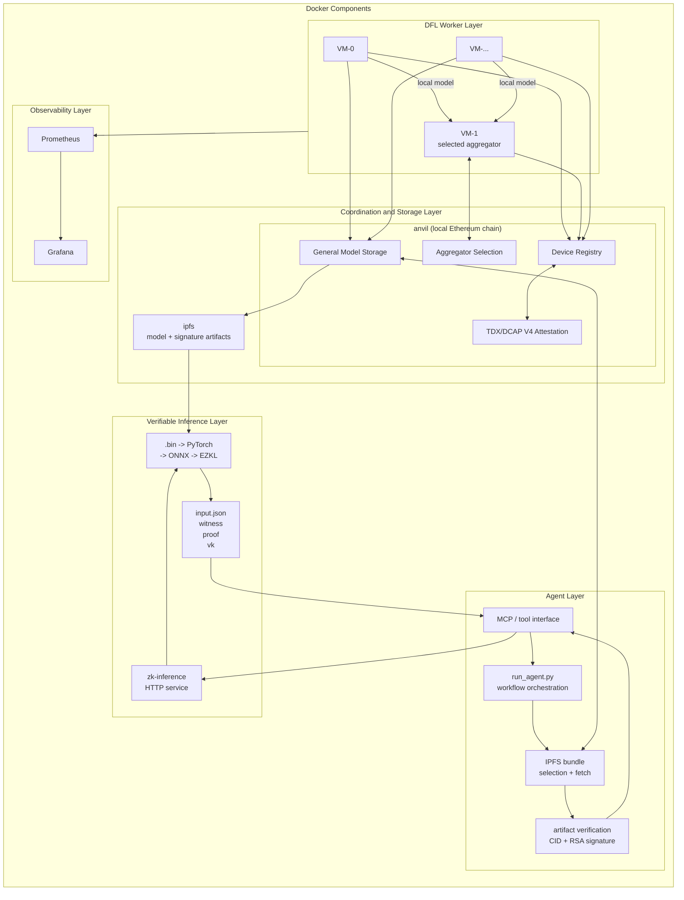
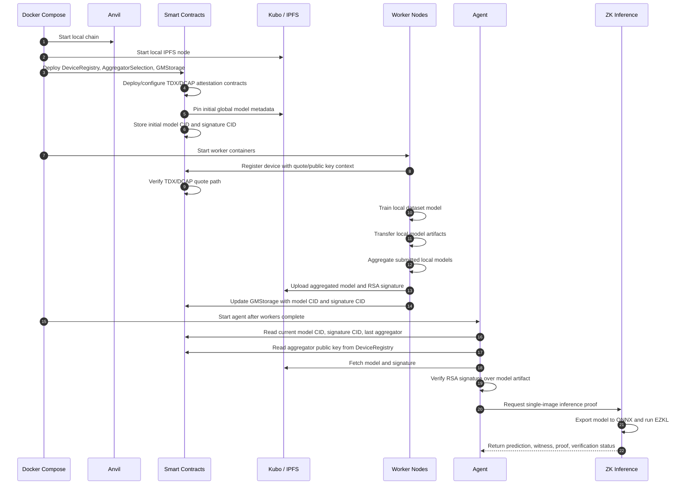

# Master Thesis Prototype: Trusted DFL and Verifiable Inference

[](https://github.com/uZhW8Rgl/Master-Thesis/actions/workflows/ci.yml)

This repository contains a proof-of-concept implementation for trusted decentralized federated learning (DFL), model provenance, and verifiable single-image inference.

The current prototype combines:

- decentralized CNN training with multiple worker nodes,
- smart-contract-based coordination and model metadata,
- local IPFS/Kubo storage for global model artifacts,
- TDX/DCAP quote verification through Solidity contracts,
- RSA signature verification for global model artifacts,
- EZKL-based zero-knowledge inference for a single dataset image,
- and a local LangChain/Ollama agent that orchestrates contract lookup, artifact verification, and proof generation.

## Repository Structure

- [compose.yml](./compose.yml): Docker Compose entry point for local end-to-end runs.
- [.env.example](./.env.example): Example runtime configuration; copy this to `.env` before running Docker Compose.
- [data](./data): Shared local input artifacts and helpers, including dataset files, RSA worker keys, the TDX quote, and single-image sample extraction utilities.
- [observability](./observability): Grafana and Prometheus configuration.
- [smart_contracts](./smart_contracts/README.md): Focused Foundry project with DFL contracts and TDX/DCAP attestation deployment logic.
- [dfl/node_server](./dfl/node_server/README.md): Node.js orchestration layer used by each worker.
- [dfl/neural_network](./dfl/neural_network/README.md): Python/PyTorch CNN training, transfer, aggregation, and model serialization.
- [zk_inference](./zk_inference/README.md): ONNX export, single-image query creation, EZKL proof generation, and proof verification.
- [agent](./agent/README.md): Local LangChain/MCP agent for contract-based model lookup, signature verification, and ZK inference.

## Architecture

The prototype is organized around a Docker Compose runtime. The diagrams below show the main runtime components and the end-to-end execution path from local infrastructure startup to verifiable inference.

### Runtime Component Overview



### End-to-End Sequence



## Component Responsibilities

| Component | Responsibility | Main entry point |
| --- | --- | --- |
| `compose.yml` | Local orchestration for infrastructure, contracts, workers, agent, and proof service | `docker compose up --build` |
| `smart_contracts` | DFL coordination, device registry, model metadata, and TDX/DCAP deployment scripts | `smart_contracts/starter_docker.sh` |
| `dfl/node_server` | Worker orchestration, contract interaction, timing logic, and metrics | `dfl/start_node_neural_network.sh` |
| `dfl/neural_network` | PyTorch training, local model transfer, aggregation, and serialization | `dfl/neural_network/cli.py` |
| `ipfs` | Local content-addressed storage for global model artifacts | Kubo API on `127.0.0.1:5001` |
| `agent` | Contract-based model lookup, artifact fetching, signature verification, and proof orchestration | `agent/run_agent.py` |
| `zk_inference` | ONNX export, single-query generation, EZKL witness/proof generation, and verification | `zk_inference/server.py` |
| `observability` | Local metrics and dashboarding | Grafana on `127.0.0.1:3300` |

## Design Notes

- `GMStorage` is treated as the source of truth for the active global model and signature CIDs.
- IPFS stores bytes, but authenticity is checked through on-chain metadata and the aggregator's registered public key.
- TDX/DCAP verification is represented by the on-chain attestation deployment and quote verification flow used during worker registration.
- The ZK inference path proves one selected single-image inference over the exported model artifacts; it complements, but does not replace, model provenance checks.
- The local runtime is intended as a reproducible research prototype rather than a production deployment.

## Reproducible Demo

### Evaluation branch: local 25-worker profile

This branch provides `.env.example` as the versioned template for the Docker-only ChestMNIST evaluation. Create the ignored local `.env.evaluation` from it so that an existing `.env` remains untouched. The profile uses local Anvil and Kubo, replays the stored TDX quote, and obtains the required DCAP collateral from Intel PCS instead of a Phala service. Always pass the file explicitly so that both the initial Compose process and the UI control service continue to use it:

```bash
cp .env.example .env.evaluation
docker compose --env-file .env.evaluation down --volumes --remove-orphans
docker compose --env-file .env.evaluation up --build --force-recreate
```

The profile exposes all 25 workers to the UI. `WORKER_COUNT`, `CLIENT_LIMIT`, `ROUND`, and `EPOCH` can be adjusted from the UI before starting a training run; those changes are written to `.env.evaluation`, not `.env`. The bundled worker keys are deterministic Anvil test credentials and must never be reused outside the local chain.

The versioned evaluation template partitions the complete ChestMNIST training
split across 25 IID shards. A learned round expects 24 submissions because the
selected aggregator does not submit its own shard; thus, one round processes
about 96% of the training split. The current `.env.evaluation` setting
`ROUND=50` includes the round-0 bootstrap rollover and therefore produces 49
learned aggregations. The evaluation profile
uses two local epochs per learned round and limits each worker to one PyTorch
intra-op and one inter-op thread so that 25 containers do not oversubscribe the
host CPU. The learning rate remains `0.003` through source round 20 and then
follows a late cosine decay to `0.00075` in source round 49. ChestMNIST training
uses the reproducible configuration documented in
`dfl/neural_network/README.md`; the local quote remains a replayed fixture and
is not evidence of execution on Phala.

Multi-label decision thresholds are fitted per pathology on the official
Validation split and only then applied to the Test split. Their predicted-positive
count is capped at twice the pathology's Validation prevalence so that a very
rare label cannot select an extremely permissive threshold. The exported metrics
distinguish this calibrated Macro-F1 from the diagnostic Macro-F1 at threshold
`0.5`, and also include threshold-independent Macro-AUROC and Macro-AUPRC.

For a clean local demo, start from a fresh stack and use Docker Compose as the single entry point:

```bash
cp .env.example .env
docker compose down --volumes --remove-orphans
KEEP_ALIVE=0 docker compose up --build --force-recreate
```

If Docker reports `Conflict. The container name "/ipfs_local" is already in use`, a separate Kubo/IPFS container is already running on your machine with the same fixed name and host ports. Stop and remove that old container before starting this stack:

```bash
docker stop ipfs_local
docker rm ipfs_local
```

The `.env` file is intentionally ignored by Git. Start from `.env.example`, review the values for your local setup, and keep machine-specific changes in `.env`.

This is the recommended demo run for the thesis prototype. It rebuilds the active services, launches the local infrastructure, deploys the contracts, runs the DFL flow, stores the new global model in IPFS, and updates the on-chain metadata.

After the stack is up, the browser frontend is available at:

- `http://127.0.0.1:8089` for the thesis agent website with the chat UI and embedded Grafana dashboard
- `http://127.0.0.1:3300` for the standalone Grafana instance

## Demo Outcome

When the run completes successfully, you should have:

- a local Anvil chain with deployed DFL and attestation contracts,
- a local IPFS node with the global model and signature pinned,
- completed worker runs for training and aggregation,
- observability data in Grafana and Prometheus,
- the website at `http://127.0.0.1:8089` with the agent chat and dashboard view,
- and a ready-to-run verifiable inference path through `agent/run_agent.py`.

The most important generated outputs are:

- `agent/downloads/`: model and signature bundles fetched by the agent
- `zk_inference/out/`: ONNX, EZKL settings, witness, proof, and verification key
- `zk_inference/single_query/`: single-image query input and prediction metadata
- `smart_contracts/broadcast/`: deployment metadata and latest contract addresses

## Recommended Local Run

The Docker setup is the primary way to run the DFL prototype:

```bash
cp .env.example .env
docker compose down --volumes --remove-orphans
KEEP_ALIVE=0 docker compose up --build --force-recreate
```

This starts Anvil, Kubo/IPFS, observability services, deploys the smart contracts, registers workers through TDX quote verification, runs training, aggregates local models, stores the new global model and signature in IPFS, and updates the on-chain model metadata.

For local Anvil runs, `P256_MODE=native` is the default. The deployment script probes the native P-256 precompile at `0x0000000000000000000000000000000000000100` and uses it when available. If the current Anvil build does not expose the precompile, the script installs the local P-256 verifier at the same canonical address so the contracts still use the native verifier address. `P256_MODE=fallback` can be used to force the Daimo fallback verifier address instead.

The local stack starts:

- Anvil as local Ethereum-compatible chain,
- Kubo as local IPFS node,
- the `smart-contracts` deployment container,
- three DFL worker containers,
- Grafana and Prometheus.

The root `.env` file provides the local timing, account, contract, IPFS, and dataset configuration. Use `.env.example` as the tracked template and keep local edits in `.env`. `IPFS_PROVIDER` is a strict switch: `kubo` uses only the local Kubo API/gateway, while `pinata` uses only the configured Pinata gateway/JWT path. The local Docker flow also uses RSA keys from `data/rsa_keys`, dataset artifacts under `data/mnist` or `data/chestmnist`, and the TDX quote from `data/phala_tdx_quote`.

For dataset experiments, `DATASET_NAME=mnist` remains the default. `DATASET_NAME=chestmnist` switches the worker training path to ChestMNIST `.npz` shards under `data/chestmnist`.

## Quick Verification

After `docker compose up`, these quick checks confirm that the core demo finished in a meaningful state:

1. Check that the main containers are healthy or completed:

```bash
docker compose ps
```

2. Query the current global model CID from `GMStorage`:

```bash
cast call 0x9fE46736679d2D9a65F0992F2272dE9f3c7fa6e0 \
  "getGlobalModel()(string)" \
  --rpc-url http://127.0.0.1:8545
```

3. Run the local verifiable inference agent:

```bash
.venv/bin/python agent/run_agent.py \
  --source contract \
  --rpc-url http://127.0.0.1:8545 \
  --gm-storage-address 0x9fE46736679d2D9a65F0992F2272dE9f3c7fa6e0 \
  --registry-address 0x5FbDB2315678afecb367f032d93F642f64180aa3 \
  --ipfs-api-url http://127.0.0.1:5001 \
  --skip-calibration
```

4. Inspect the resulting proof artifacts:

```bash
ls -lah zk_inference/out
ls -lah zk_inference/single_query
```

## Stack Flow

The sequence diagram above visualizes this flow.

1. Starts Anvil and Kubo.
2. Deploys core DFL contracts from `smart_contracts`.
3. Deploys Automata PCCS and TDX/DCAP attestation contracts.
4. Uploads PCCS collateral.
5. Pins the initial global model to IPFS and writes model metadata on-chain.
6. Starts workers.
7. Registers workers through on-chain TDX quote verification.
8. Runs local training and model transfer.
9. Aggregates submitted local models.
10. Signs and uploads the new global model and signature.
11. Updates `GMStorage` with the new model CID and signature CID.

## Observability

The local stack exposes:

- Grafana: <http://127.0.0.1:3300>
- Prometheus: <http://127.0.0.1:9090>
The Grafana dashboards use Prometheus metrics exported by the control API and the local services.

## Useful Commands

Open the local IPFS Web UI:

```text
http://127.0.0.1:5001/webui
```

Query the current global model from `GMStorage`:

```bash
cast call 0x9fE46736679d2D9a65F0992F2272dE9f3c7fa6e0 \
  "getGlobalModel()(string)" \
  --rpc-url http://127.0.0.1:8545
```

Query the current global model signature:

```bash
cast call 0x9fE46736679d2D9a65F0992F2272dE9f3c7fa6e0 \
  "getGlobalModelSignature()(string)" \
  --rpc-url http://127.0.0.1:8545
```

Clean the local stack:

```bash
docker compose -f compose.yml down --volumes --remove-orphans
```

## Agent and Verifiable Inference

After a DFL run, the agent can read the latest model metadata from the smart contracts, fetch the model and signature from IPFS, verify the signature against the last aggregator's registered public key, and run a verifiable single-image inference:

```bash
.venv/bin/python agent/run_agent.py \
  --source contract \
  --rpc-url http://127.0.0.1:8545 \
  --gm-storage-address 0x9fE46736679d2D9a65F0992F2272dE9f3c7fa6e0 \
  --registry-address 0x5FbDB2315678afecb367f032d93F642f64180aa3 \
  --ipfs-api-url http://127.0.0.1:5001 \
  --skip-calibration
```

The result includes the selected input image, predicted label, proof artifact, witness, and verification status.

## Important Generated Artifacts

Some runs create local build and proof outputs:

- `smart_contracts/out/`: Foundry artifacts for the main Foundry project.
- `smart_contracts/lib/automata-dcap-v3-attestation/lib/automata-on-chain-pccs/out/`: Foundry artifacts for the PCCS subproject.
- `zk_inference/out/`: ONNX, EZKL settings, witness, proof, and verification key.
- `zk_inference/single_query/`: single-image query input and prediction metadata.
- `agent/downloads/`: model and signature bundles fetched by the agent.

## GitHub Workflow

The repository now includes a GitHub Actions CI pipeline for:

- repository hygiene and Docker Compose validation,
- Python linting and formatting checks with Ruff,
- Node.js build and tests,
- Foundry contract builds,
- Docker image builds,
- and a runtime smoke test for the core containerized stack.

On pushes to `main`, the Docker build job publishes the project images to GitHub Container Registry:

```bash
docker pull ghcr.io/uzhw8rgl/master-thesis-agent:latest
docker pull ghcr.io/uzhw8rgl/master-thesis-zk-inference:latest
docker pull ghcr.io/uzhw8rgl/master-thesis-dfl-worker:latest
docker pull ghcr.io/uzhw8rgl/master-thesis-smart-contracts:latest
```

Each image is also tagged with the commit SHA, for example `ghcr.io/uzhw8rgl/master-thesis-agent:<commit-sha>`.

## Notes

- The active neural-network implementation is Python/PyTorch in `dfl/neural_network`.
- `smart_contracts` is the active contract and attestation project.
- The healthcare setting is the motivating scenario. The concrete prototype now supports a compact CNN on MNIST and a ChestMNIST training/query path. A full ChestMNIST Compose plus EZKL proof run should still be treated as an integration test to complete.
