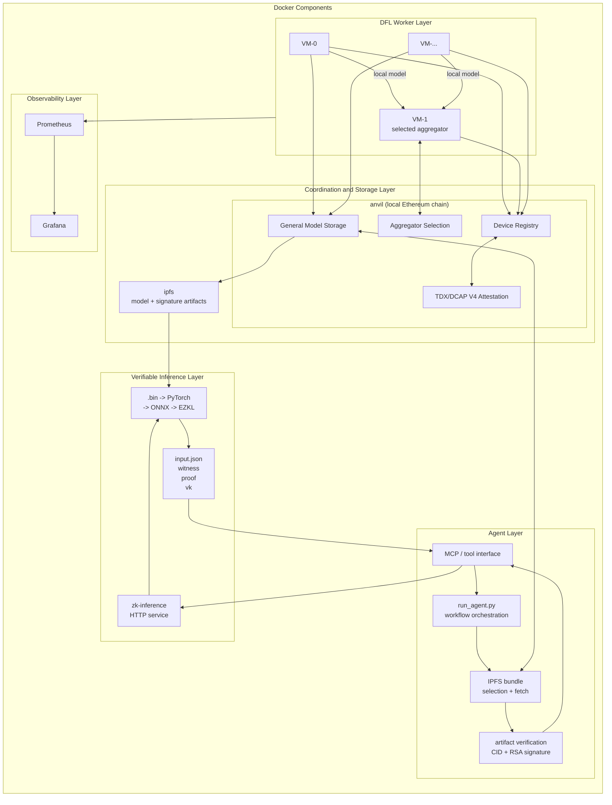

# Master Thesis Prototype: Trusted DFL and Verifiable Inference

[](https://github.com/uZhW8Rgl/vita-fl/actions/workflows/ci.yml)

This repository contains a proof-of-concept implementation for trusted decentralized federated learning (DFL), model provenance, and verifiable single-image inference.

The current prototype combines:

- decentralized CNN training with multiple worker nodes,
- smart-contract-based coordination and model metadata,
- immutable per-round aggregation thresholds, deterministic equal-weight
  federated averaging, and TEE-signed input/output statements with atomic
  model publication,
- local IPFS/Kubo storage for global model artifacts,
- TDX/DCAP quote verification through Solidity contracts,
- RSA signature verification for global model artifacts,
- EZKL-based zero-knowledge inference for a single dataset image,
- AIR/TDX-bound ChestMNIST inference in a digest-pinned Phala TEE,
- SCITT-CCF registration and local verification of transparency receipts,
- and a local LangChain/Ollama agent that orchestrates contract lookup, artifact verification, and proof generation.

## Repository Structure

- [compose.yml](./compose.yml): Docker Compose entry point for local end-to-end runs.
- [.env.example](./.env.example): Local runtime settings without worker identities.
- [.env.shared.example](./.env.shared.example): Shared configuration across local Anvil and Sepolia profiles.
- [.env.phala.anvil.example](./.env.phala.anvil.example): Chain-specific values for local Anvil runs.
- [.env.sepolia.example](./.env.sepolia.example): Chain-specific values for Sepolia runs.
- [data](./data): Shared local input artifacts and helpers. Generated RSA worker keys are local-only and ignored by Git.
- [observability](./observability): Grafana and Prometheus configuration.
- [smart_contracts](./smart_contracts/README.md): Focused Foundry project with DFL contracts and TDX/DCAP attestation deployment logic.
- [dfl/node_server](./dfl/node_server/README.md): Node.js orchestration layer used by each worker.
- [dfl/neural_network](./dfl/neural_network/README.md): Python/PyTorch CNN training, transfer, aggregation, and model serialization.
- [zk_inference](./zk_inference/README.md): ONNX export, single-image query creation, EZKL proof generation, and proof verification.
- [tee_inference](./tee_inference/README.md): PyTorch ChestMNIST inference service with deterministic CBOR and AIR/TDX evidence.
- [transparency_log](./transparency_log/README.md): Persistent Microsoft SCITT-CCF ledger in virtual mode.
- [agent](./agent/README.md): Local LangChain/MCP agent for contract-based model lookup, ZK inference, and verified TEE inference with SCITT registration.

## Docker Compose Files

- [compose.yml](./compose.yml): Main local VITA-FL stack with blockchain,
  IPFS, UI, workers, and inference services.
- [transparency_log/compose.yml](./transparency_log/compose.yml): Standalone
  SCITT-CCF transparency log with persistent storage.

## Published Container Images

The Phala launcher resolves the release tags in
[phala/image-sources.json](./phala/image-sources.json) to immutable digests.
Successful publish workflows pass their exact build digest directly to the
Phala deployment workflow. Image IDs do not need to be copied into env files or
Terraform. The selected image set is recorded in the Terraform
`deployment_images` output, including during an interrupted rollout.

| Component | Release tag |
| --- | --- |
| Combined DFL worker and Worker 0 TEE inference | `ghcr.io/uzhw8rgl/master-thesis-dfl-worker:phala` |
| Smart-contract runtime | `ghcr.io/uzhw8rgl/master-thesis-smart-contracts:phala` |
| Control API | `ghcr.io/uzhw8rgl/master-thesis-control-api:control` |
| Browser UI | `ghcr.io/uzhw8rgl/master-thesis-ui:ui` |
| Agent | `ghcr.io/uzhw8rgl/master-thesis-agent:agent` |
| Transparency log | `ghcr.io/uzhw8rgl/master-thesis-transparency-log:scitt` |
| ZK inference | `ghcr.io/uzhw8rgl/master-thesis-zk-inference:zk` |

Phala uses the combined DFL worker image for Worker 0 and its co-located TEE
inference process. The standalone TEE-inference image is published for separate
deployments and is not selected by the Phala Terraform configuration.

## Start on Phala

Once the [Phala configuration and shared Terraform state](./phala/README.md#one-time-setup)
are prepared, start or update the deployment from this directory with one line:

```bash
bash phala/start.sh
```

All Phala settings, including the API key, belong in `.env.phala.anvil`.
GitHub Actions decrypts this complete profile from `phala/deploy.env.gpg`;
the two required secrets are `PHALA_STATE_PASSPHRASE` and `PHALA_ENV_PASSPHRASE`.

The shared state is encrypted in the existing GitHub repository's `phala-state`
branch. This needs no additional cloud account or VM. Without the GitHub state
configuration, the launcher uses local Terraform state for local-only deployments.
The launcher resolves images, checks existing apps and workers, and configures
the runtime endpoints. Open the reported UI, choose **Training Setup**, and
press **Start Training** to commit the participant roster and launch the selected
worker TEEs. Worker 0 also provides TEE inference.

After the [GitHub Actions setup](./phala/README.md#automatic-deployment-after-image-publishing),
each successful publish on the configured deployment branch updates Phala
automatically. Deployment changes reset this prototype's training run and remove
its old workers when runtime or worker configuration changes; an unchanged
deployment is left running. Export evaluation data
before publishing a change to an active experiment. The
[Phala guide](./phala/README.md#existing-workers-retries-and-recovery) explains
retries, existing workers, explicit recreation, and teardown.

### Preview, recreate, or delete

Run these commands from this directory with your configured deployment profile:

```bash
# Preview changes without applying or deleting resources.
bash phala/start.sh --dry-run

# Delete the existing demo and create a fresh runtime.
bash phala/start.sh --recreate

# Delete the deployment, including leftover worker CVMs.
bash phala/start.sh --destroy
```

`--recreate` and `--destroy` erase the current run's chain state, IPFS data, and
training progress. After recreation, start training yourself in the UI.

## Architecture

The diagram below shows the main runtime components and their connections.

### Runtime Component Overview


