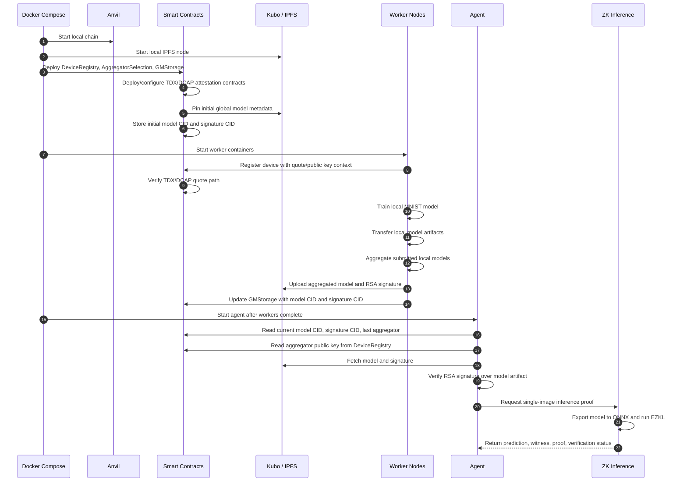

# Architecture

This document summarizes the current end-to-end execution flow and the main component responsibilities.

The sequence diagram uses Mermaid so it renders directly on GitHub and can be exported or redrawn for the thesis document.

## End-to-End Flow

## Component Responsibilities

| Component | Responsibility | Main entry point |
| --- | --- | --- |
| `compose.yml` | Local orchestration for infrastructure, contracts, workers, agent, and proof service | `docker compose up --build` |
| `smart_contracts` | DFL coordination, device registry, model metadata, and TDX/DCAP deployment scripts | `smart_contracts/starter_docker.sh` |
| `dfl/node_server` | Worker orchestration, contract interaction, timing logic, and tracing | `dfl/start_node_neural_network.sh` |
| `dfl/neural_network` | PyTorch training, local model transfer, aggregation, and serialization | `dfl/neural_network/cli.py` |
| `ipfs` | Local content-addressed storage for global model artifacts | Kubo API on `127.0.0.1:5001` |
| `agent` | Contract-based model retrieval, artifact fetching, signature verification, and proof orchestration | `agent/run_agent.py` |
| `zk_inference` | ONNX export, single-query generation, EZKL witness/proof generation, and verification | `zk_inference/server.py` |
| `observability` | Local logs, traces, metrics, and dashboarding | Grafana on `127.0.0.1:3000` |

## Design Notes

- `GMStorage` is treated as the source of truth for the active global model and signature CIDs.
- IPFS stores bytes, but authenticity is checked through on-chain metadata and the aggregator's registered public key.
- TDX/DCAP verification is represented by the on-chain attestation deployment and quote verification flow used during worker registration.
- The ZK inference path proves one selected MNIST inference over the exported model artifacts; it complements, but does not replace, model provenance checks.
- The local runtime is intended as a reproducible research prototype rather than a production deployment.
