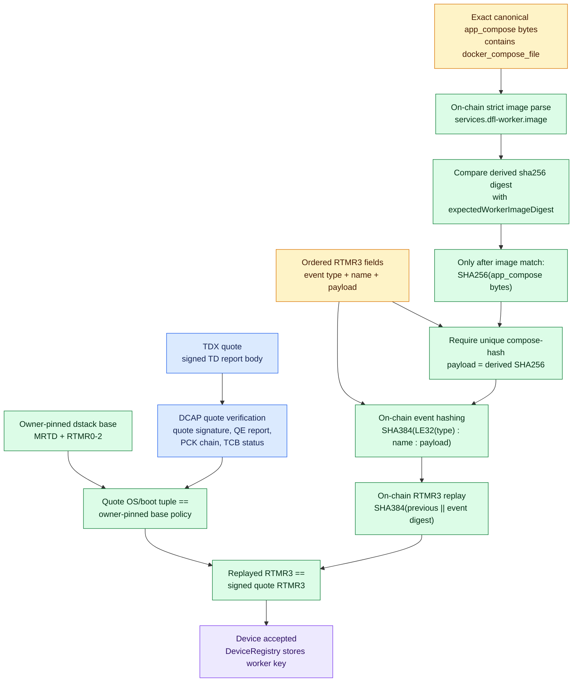

# Intel TDX Quote and DCAP Verification

This section explains the structure of the Intel TDX quote used by the prototype, the relevant signatures, and how the values verified by the smart contracts are derived.

The quote is the central attestation artifact. It binds a TDX guest measurement and user-provided report data to an Intel-backed certificate chain. In this prototype, the live quote, canonical `app_compose`, and full RTMR3 runtime event log are submitted to `DeviceRegistry.registerDeviceWithAttestedAppCompose(...)`. A device is registered only after on-chain image-digest extraction, DCAP verification, RTMR3 reconstruction, and verification of the Registry-generated REPORTDATA commitment.

## Quote Structure

A TDX quote v4 consists of three main parts:

| Part | Purpose | Values used in this prototype |
| --- | --- | --- |
| Quote header | Identifies quote version, attestation key type, TEE type, and QE vendor | quote version `0x0400`, attestation key type `0x0200`, TDX TEE type `0x81000000`, Intel QE vendor ID |
| TD report body | Contains the TDX guest measurements and user-controlled report data | `teeTcbSvn`, `mrtd`, `reportData`; additional TDX measurement fields are present but not all are interpreted by the prototype |
| Signature data | Authenticates the quote and binds the attestation key to Intel collateral | quote signature, attestation key, QE report, QE report signature, QE auth data, PCK certificate chain |

The smart contract parser extracts the following fields:

- `teeTcbSvn`: TDX TCB SVN from the TD report body.
- `mrtd`: measurement of the TDX guest.
- `reportData`: 64 bytes chosen by the attested workload or caller.
- `quoteSignature`: ECDSA signature over the quote header and TD report body.
- `attestationKey`: public key used to verify the quote signature.
- `qeReport`: SGX enclave report of the Quote Enclave.
- `qeReportSignature`: signature over the QE report.
- `certification`: PCK certificate chain used to authenticate the QE report signature.

Phala exposes a broader set of quote measurements. The current on-chain parser verifies the complete signed TD report body and extracts the fields needed for TCB evaluation, registration binding, dstack base-runtime policy, and application `RTMR3` replay. In the TDX report body, the relevant offsets are:

| Phala field | Quote location | Meaning | Current prototype handling |
| --- | --- | --- | --- |
| `PPID` | PCK certificate / platform identity context | Platform provisioning identity used in Intel provisioning and certificate material. | Not extracted by the prototype contract. The contract verifies the PCK chain and uses certificate TCB/FMSPC information, but does not expose PPID. |
| `USER DATA` | Quote header, 20 bytes | User data field in the quote header. | Parsed as `header.userData` and covered by the quote signature, but not used in registration logic. |
| `TEE TCB SVN` | TD report body offset `0`, 16 bytes | TDX TCB security version numbers. | Extracted as `teeTcbSvn` and used for TCB status evaluation. |
| `MRSEAM` | TD report body offset `16`, 48 bytes | Measurement of the Intel TDX module. | Covered by the quote signature, but not extracted separately. |
| `MRTD` | TD report body offset `136`, 48 bytes | Initial measurement of the TD guest. | Extracted and required to match the owner-pinned dstack base-runtime tuple. |
| `MRCONFIG` / `MRCONFIGID` | TD report body offset `184`, 48 bytes | TD configuration identifier. | Covered by the quote signature, but not extracted separately. |
| `MROWNER` | TD report body offset `232`, 48 bytes | Owner-defined measurement. | Covered by the quote signature, but not extracted separately. |
| `MROWNERCONFIG` | TD report body offset `280`, 48 bytes | Owner-defined configuration measurement. | Covered by the quote signature, but not extracted separately. |
| `RTMR0` | TD report body offset `328`, 48 bytes | Runtime measurement register 0. | Extracted and compared with the owner-pinned dstack OS/boot tuple. |
| `RTMR1` | TD report body offset `376`, 48 bytes | Runtime measurement register 1. | Extracted and compared with the owner-pinned dstack OS/boot tuple. |
| `RTMR2` | TD report body offset `424`, 48 bytes | Runtime measurement register 2. | Extracted and compared with the owner-pinned dstack OS/boot tuple. |
| `RTMR3` | TD report body offset `472`, 48 bytes | Runtime measurement register 3. | Extracted and compared with the on-chain replay of the submitted structured application events. |
| `REPORT DATA` | TD report body offset `520`, 64 bytes | Application-controlled data bound to the quote. | Extracted as `reportData` and returned by the attestation contract. |

This distinction matters: even when a field is not interpreted as a policy input, it is still inside `signedData = quoteHeader || tdReportBody`. Therefore, changing `MRSEAM`, `MRCONFIGID`, `MROWNER`, `MROWNERCONFIG`, or any `RTMR` value would invalidate the quote signature unless the quote were regenerated by the attestation flow. In addition to this signature coverage, the prototype now applies explicit equality policy to `MRTD` and `RTMR0`--`RTMR2` and reconstructs application-specific `RTMR3`.

## Current Prototype Scope

The current prototype implements quote verification as a trust gate for worker registration. The submitted quote is parsed on-chain, structurally validated, and checked through the DCAP verification chain before the worker address and public key are stored in `DeviceRegistry`. This means the prototype currently verifies that the quote is well formed, belongs to the expected TDX quote type, is signed by a valid attestation key, and is backed by a valid PCK certificate chain and Intel collateral. The TDX TCB state is also evaluated through `teeTcbSvn`, PCK TCB values, FMSPC-based TCB Info, and QE identity information.

The prototype explicitly extracts and uses the values needed for this registration and provenance flow. These include `teeTcbSvn` for TCB evaluation, `mrtd` and `rtmr0`--`rtmr2` for the owner-pinned dstack base-runtime comparison, `rtmr3` for structured application-event replay, and `reportData` for registration-specific identity and freshness binding, in addition to the quote and certificate-chain signature inputs. After successful verification, the contract returns `TCBStatus || mrtd || reportData || fmspc`, while the verifier has already required the base-runtime tuple and replayed application measurement to match their respective policies.

Several Phala-displayed measurements remain present in the signed quote without being separate equality-policy inputs, including `MRSEAM`, `MRCONFIGID`, `MROWNER`, and `MROWNERCONFIG`. They are still protected against tampering because the complete TD report body is part of the data signed by the quote signature. The implementation therefore combines quote authenticity and platform/TCB validation with a deliberately scoped dstack measurement policy rather than attempting to allowlist every TDX field.

This leaves a clear extension point for an even stricter production-oriented design: the verifier could additionally require exact matches or approved sets for `MRSEAM`, `MRCONFIGID`, `MROWNER`, and `MROWNERCONFIG`. The current policy already constrains the dstack OS/boot basis and reconstructs the measured application identity, but it does not claim that every TDX configuration field is independently pinned.

## Can Measurements Prove That Specific Code, YAML, or an Image Ran?

The measurements can provide strong evidence that a specific workload configuration was started, but they do not automatically prove this by themselves. A quote only contains cryptographic measurement values. To turn those values into a statement such as "this exact Docker image and this exact YAML file ran", an external verifier must know how the expected values were produced and compare the quoted measurements against independently computed reference values.

For Phala/dstack deployments, the most relevant application-level measurement is `RTMR3`. Phala documents `RTMR3` as an application-specific hash chain that includes values such as the application id, the compose hash, the instance id, and the key provider. The compose hash is derived from the deployed application configuration, including the raw Docker Compose file and metadata. Therefore, if the verifier has the expected compose file, recomputes the compose hash, replays the RTMR3 event log, and obtains the same final `RTMR3` value as the quote, this gives evidence that the quoted CVM booted with that application configuration.

For Docker images, the important condition is that the YAML must reference immutable image digests, not mutable tags. A line such as `image: app:latest` is not enough, because `latest` can point to different image contents over time. A line such as `image: app@sha256:<digest>` is much stronger because the digest identifies the exact image bytes pulled by Docker. If the compose file is measured into `RTMR3` and the image references are pinned by digest, the attestation can be linked to a specific image digest.

For source code, the proof is one step further removed. TDX measurements do not directly know about a Git commit or source repository. They can only attest to measured runtime artifacts, such as VM state, boot chain, compose configuration, and image digests. To claim that a specific source code version ran, the image digest must be linked back to source code through a trusted build process. Common approaches are reproducible builds, signed container images, software bills of materials, or build provenance such as GitHub Actions/Sigstore attestations. In that case, the chain becomes:

```text
source commit -> reproducible/signed build -> Docker image digest -> compose file -> compose hash -> RTMR3 -> TDX quote
```

### Phala App Code to RTMR3

The current Phala-oriented verification path links the deployed application configuration to the `RTMR3` value in the quote through the exact SDK-canonical `app_compose` byte preimage and the structured RTMR3 event log. The embedded `docker_compose_file` must pin the sole `dfl-worker` service to an immutable image digest, for example `ghcr.io/uzhw8rgl/master-thesis-dfl-worker@sha256:<digest>`.

The order of checks matters. `DeviceRegistry` first parses those bytes on-chain, extracts the image digest from the strict `services.dfl-worker.image` field, and compares the derived value with the configured image policy. Only after that succeeds does it compute `SHA-256(app_compose)`. The verifier receives ordered event fields rather than trusted event digests and reconstructs each dstack event digest itself:

```text
rtmr3_0 = 48 zero bytes
event_digest_i = SHA384(LE32(event_type_i) || ":" || event_name_i || ":" || event_payload_i)
rtmr3_i = SHA384(rtmr3_{i-1} || event_digest_i)
```

The verifier additionally requires the live quote's `MRTD` and `RTMR0`--`RTMR2` to match an owner-pinned dstack OS/boot tuple extracted from a reference quote during bootstrap. That reference quote supplies only the base-runtime policy: its application `RTMR3` and Compose hash are not fixed for this selector. The verifier then requires the dstack runtime event type `0x08000001`, exactly one `compose-hash` event whose payload equals the Registry-derived SHA-256 value, and a final replayed `RTMR3` equal to the field inside the signed TDX quote. The worker performs SDK-compatible checks as a diagnostic preflight, but neither a worker-supplied image digest, a compose-hash allowlist, nor precomputed event digests are trusted by the registration decision.



This means the answer is conditional:

- A specific YAML/configuration can be attested when its exact canonical byte preimage is hashed on-chain and connected to the quote through the reconstructed `compose-hash` event and RTMR3 replay.
- A specific Docker image can be identified when the on-chain parser derives its immutable SHA-256 digest from that measured preimage before the compose hash is accepted.
- A specific source code version can be attested only if the Docker image digest is cryptographically linked to that source version through reproducible builds or signed build provenance.
- A quote alone is not enough to identify code semantically. It must be interpreted together with the structured event log, measured deployment preimage, configured image policy, and image/source provenance.

The worker serializes `app_compose` with the same normalization and deterministic JSON ordering as the official dstack SDK. On-chain, `DeviceRegistry` strictly extracts the single `services.dfl-worker.image` value from its `docker_compose_file`, derives the `sha256` image digest, and compares it with `expectedWorkerImageDigest`. The narrow parser rejects any second service declaration as well as flow- or merge-style service declarations. Only then does the Registry calculate `SHA-256(canonicalAppCompose)`. The attestation verifier first requires the reference-pinned dstack `MRTD`/`RTMR0`--`RTMR2` OS/boot tuple, then recomputes each runtime-event digest as `SHA-384(LE32(0x08000001) || ":" || eventName || ":" || payload)`, requires the derived compose hash as the unique `compose-hash` payload, replays RTMR3 as `SHA-384(previousRTMR || eventDigest)`, and compares the result with the hardware-signed quote RTMR3. The reference quote does not constrain Compose or `RTMR3`, and no compose-hash allowlist or worker-supplied image claim is trusted.

```mermaid
flowchart LR
  Source["Source code\nGit commit"] --> Build["Trusted build\nreproducible or signed"]
  Build --> Image["Docker image\nsha256 digest"]
  Image --> Compose["Docker Compose YAML\nimage pinned by digest"]
  Compose --> ComposeHash["Compose hash"]
  ComposeHash --> EventLog["RTMR3 event log\nhash-chain replay"]
  EventLog --> RTMR3["Final RTMR3\ninside TDX quote"]
  RTMR3 --> Quote["Intel TDX quote\nsigned by attestation chain"]
  Quote --> Verifier["External verifier\ncompares expected vs quoted values"]

  classDef implemented fill:#dcfce7,stroke:#15803d,color:#052e16
  classDef required fill:#fef3c7,stroke:#d97706,color:#451a03
  classDef external fill:#e5e7eb,stroke:#6b7280,color:#111827

  class RTMR3,Quote implemented
  class Image,Compose,ComposeHash,EventLog required
  class Source,Build,Verifier external
```



## Signature and Binding Chain

The quote verification is a chain of cryptographic bindings:

1. The TDX module produces a TD report containing the guest measurement (`mrtd`) and `reportData`.
2. The Quote Enclave signs the quote header and TD report body with an attestation key.
3. The quote signature is verified as:

```text
ECDSA_P256_VERIFY(
  public_key = attestationKey,
  message    = SHA256(quoteHeader || tdReportBody),
  signature  = quoteSignature
)
```

4. The attestation key itself must be authorized. This is done through the QE report. The QE report contains a hash in its `reportData` field:

```text
expectedHash = qeReport.reportData[0:32]
computedHash = SHA256(attestationKey || qeAuthData)
expectedHash == computedHash
```

This binds the attestation key and optional QE authentication data to the QE report.

5. The QE report is signed by the PCK certificate key:

```text
ECDSA_P256_VERIFY(
  public_key = PCK certificate public key,
  message    = SHA256(rawQeReport),
  signature  = qeReportSignature
)
```

6. The PCK certificate chain is verified against Intel DCAP collateral. The prototype expects a three-certificate chain:

```text
PCK leaf certificate -> Intel intermediate CA -> Intel SGX root CA
```

7. The PCK certificate contains platform TCB information such as CPU SVN, PCE SVN, and FMSPC. The FMSPC is used to load the matching TCB Info collateral.
8. The QE identity collateral is checked against the QE report fields such as `mrsigner`, `attributes`, `miscselect`, `isvprodid`, and `isvsvn`.
9. The TDX TCB level is checked by comparing `teeTcbSvn` and the PCK TCB values against the Intel TCB Info levels.

If all checks succeed, the quote is accepted. In this prototype, the attestation contract returns:

```text
TCBStatus || mrtd || reportData || fmspc
```

This output summarizes the accepted TCB status, the measured TDX guest, the bound report data, and the platform family used for TCB lookup.

## How Important Values Are Derived

| Value | Source | How it is used |
| --- | --- | --- |
| `mrtd` | TD report body | Represents the measured TDX guest. It is part of the quote data signed by the attestation key. |
| `mrseam` | TD report body | Represents the measured TDX module. It is signed as part of the TD report body, but the prototype does not currently expose it. |
| `mrconfigId` | TD report body | Represents the TD configuration identity. It is signed as part of the TD report body, but the prototype does not currently expose it. |
| `mrowner` | TD report body | Represents the TD owner identity or owner-defined measurement. It is signed as part of the TD report body, but the prototype does not currently expose it. |
| `mrownerConfig` | TD report body | Represents owner-defined configuration. It is signed as part of the TD report body, but the prototype does not currently expose it. |
| `rtmr0` - `rtmr3` | TD report body | Runtime measurement registers. They are signed as part of the TD report body, but the prototype does not currently expose them. |
| `reportData` | TD report body | User-controlled 64-byte field. It can bind application-specific data, such as a hash, public key, or nonce, to the quote. |
| `teeTcbSvn` | TD report body | Compared with Intel TDX TCB levels to determine whether the TDX platform state is acceptable. |
| `attestationKey` | Quote signature section | Verifies the quote signature over the header and TD report body. |
| `quoteSignature` | Quote signature section | Proves that the quote body was signed by the attestation key. |
| `qeReport.reportData` | QE report | First 32 bytes must equal `SHA256(attestationKey || qeAuthData)`, binding the attestation key to the QE report. |
| `qeReportSignature` | QE report certification data | Proves that the QE report was signed by the PCK certificate key. |
| `PCK certificate` | Certification data | Authenticates the QE report signing key and provides platform TCB values. |
| `fmspc` | PCK certificate extension | Selects the corresponding Intel TCB Info collateral. |
| `QE identity` | Intel collateral | Checks that the Quote Enclave identity and SVN are acceptable. |
| `TCB Info` | Intel collateral | Determines the platform TCB status from `teeTcbSvn`, CPU SVN, PCE SVN, and TDX module identity. |

## Mermaid Diagram

Color legend:

- Green: implemented and explicitly checked or used by the prototype.
- Yellow: cryptographically covered by the quote signature, but not interpreted as a separate policy input.
- Gray: available in certificate or quote context, but not exposed by the current prototype.

```mermaid
flowchart TB
  subgraph Quote["TDX Quote v4"]
    Header["Quote Header\nversion, TEE type, QE vendor"]
    UserData["USER DATA\nparsed, signed, not used as policy"]

    subgraph TDReport["TD Report Body"]
      TeeTcb["TEE TCB SVN\nextracted + TCB checked"]
      Mrtd["MRTD\nextracted + returned"]
      ReportData["REPORT DATA\nextracted + returned"]
      Mrseam["MRSEAM\nsigned, no separate policy"]
      Mrconfig["MRCONFIGID\nsigned, no separate policy"]
      Mrowner["MROWNER\nsigned, no separate policy"]
      MrownerConfig["MROWNERCONFIG\nsigned, no separate policy"]
      Rtmr["RTMR0-3\nsigned, no separate policy"]
    end

    QuoteSig["Quote Signature\nchecked"]
    AttKey["Attestation Key\nchecked"]
    QEReport["QE Report\nidentity + reportData checked"]
    QEAuth["QE Auth Data\nused for key binding"]
    QEReportSig["QE Report Signature\nchecked"]
    CertChain["PCK Certificate Chain\nverified"]
    PPID["PPID\ncertificate/platform context\nnot exposed"]
  end

  subgraph Contract["On-chain Verification"]
    Parser["V4Parser\nparse and validate structure"]
    QuoteVerify["Verify quote signature\nSHA256(header || TD report)"]
    KeyBinding["Check attestation key binding\nQE reportData == SHA256(attestationKey || qeAuthData)"]
    CertVerify["Verify PCK certificate chain"]
    QEVerify["Verify QE report signature\nSHA256(raw QE report)"]
    QEIdentity["Check QE identity collateral"]
    TCBCheck["Check TDX TCB level\nteeTcbSvn + PCK TCB + TCB Info"]
    Output["Accepted output\nTCBStatus || mrtd || reportData || fmspc"]
    MissingPolicy["Not currently implemented\nmeasurement allowlist for\nMRSEAM / MRCONFIGID / MROWNER / RTMRs"]
  end

  Header --> Parser
  UserData --> Parser
  TDReport --> Parser
  QuoteSig --> Parser
  AttKey --> Parser
  QEReport --> Parser
  QEAuth --> Parser
  QEReportSig --> Parser
  CertChain --> Parser
  PPID -. not extracted .-> Parser

  Parser --> QuoteVerify
  Header --> QuoteVerify
  TDReport --> QuoteVerify
  QuoteSig --> QuoteVerify
  AttKey --> QuoteVerify

  Parser --> KeyBinding
  AttKey --> KeyBinding
  QEAuth --> KeyBinding
  QEReport --> KeyBinding

  CertChain --> CertVerify
  CertVerify --> QEVerify
  QEReport --> QEVerify
  QEReportSig --> QEVerify

  QEReport --> QEIdentity
  QEReport --> TCBCheck
  TeeTcb --> TCBCheck
  CertChain --> TCBCheck

  QuoteVerify --> Output
  KeyBinding --> Output
  QEVerify --> Output
  QEIdentity --> Output
  TCBCheck --> Output

  Mrseam -. no policy check .-> MissingPolicy
  Mrconfig -. no policy check .-> MissingPolicy
  Mrowner -. no policy check .-> MissingPolicy
  MrownerConfig -. no policy check .-> MissingPolicy
  Rtmr -. no policy check .-> MissingPolicy

  classDef checked fill:#dcfce7,stroke:#15803d,color:#052e16
  classDef covered fill:#fef3c7,stroke:#d97706,color:#451a03
  classDef missing fill:#e5e7eb,stroke:#6b7280,color:#111827
  classDef process fill:#dbeafe,stroke:#2563eb,color:#172554

  class Header,TeeTcb,Mrtd,ReportData,QuoteSig,AttKey,QEReport,QEAuth,QEReportSig,CertChain checked
  class UserData,Mrseam,Mrconfig,Mrowner,MrownerConfig,Rtmr covered
  class PPID,MissingPolicy missing
  class Parser,QuoteVerify,KeyBinding,CertVerify,QEVerify,QEIdentity,TCBCheck,Output process
```



## Relation to Device Registration

In the prototype, `DeviceRegistry.registerDeviceWithAttestedAppCompose(...)` receives:

- the TDX quote,
- the exact SDK-canonical `app_compose` bytes and the ordered structured RTMR3 event fields,
- the device address,
- networking metadata,
- and the device public key used later for model artifact signatures.

Before requesting the quote, the worker obtains an exact 64-byte `REPORTDATA` commitment from the Registry. The Registry first extracts the digest-pinned worker image from `app_compose` onchain and checks it against the configured image policy. It then hashes those exact bytes, reconstructs every RTMR3 runtime-event digest onchain, and checks the replayed RTMR3 against the signed quote. `REPORTDATA` binds a deployment-specific domain, chain and Registry address, transaction sender, endpoint hashes, public-key hash, derived compose/image identity, one-time nonce, and an expiring owner challenge. The Registry requires `msg.sender` to equal the device address, consumes the challenge, and increments the nonce before storing the key. The older unbound registration selectors always revert. Later, when the agent downloads a global model artifact, it verifies the model signature against the public key of the last registered aggregator. This connects the attestation layer with model provenance:

```text
TDX quote verifies worker environment and bound REPORTDATA
DeviceRegistry consumes freshness challenge and stores the bound worker public key
Aggregator signs global model artifact
Agent verifies model signature against registered aggregator key
```

Als Abgleich wurden die aktuelle dstack-Dokumentation und die Referenzimplementierung verwendet. Die SDK-kompatible Compose-Kanonisierung, das strukturierte Runtime-Event-Format und der RTMR-Replay sind dadurch unabhängig von lokal vorgegebenen Compose- oder Event-Digest-Allowlisten nachvollziehbar.
Quellen: https://docs.phala.network/dstack/local-development und https://github.com/Dstack-TEE/dstack
